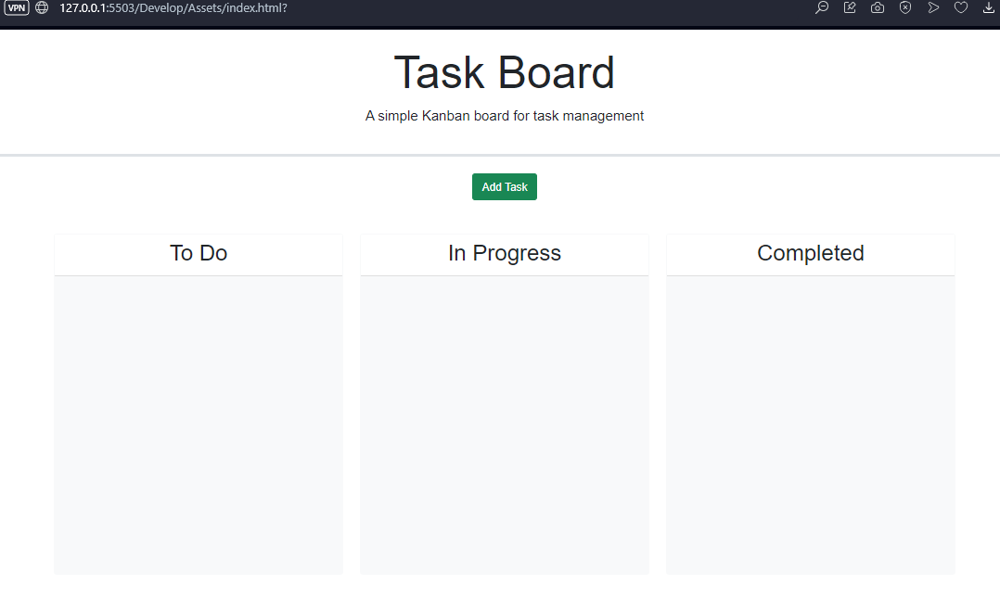
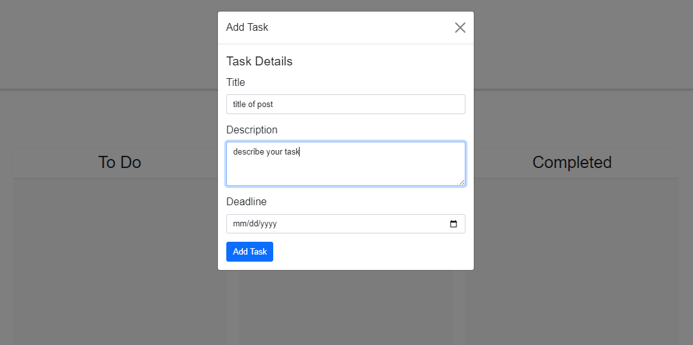
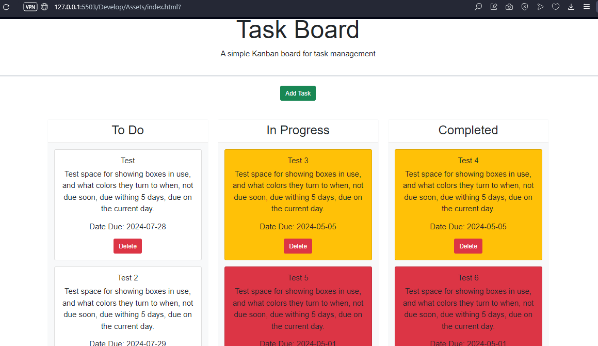

# Task Board Challenge 5
Task Board Web Page.

## Application Information
An easy to use Task Board for keeping track of upcoming task.
Allows for setting Post Titles, Post information/comments, and Post Due Date setting.

## Installation
No installation is needed, works directly in the browser.

## How to Use
1. Click on 'Add Task'
2. You will be prompted to enter the 'Title' for your task post.
3. Followed by, 'Description' where you fill in your task post information on what your task is actually about.
4. Press the 'Due Date' to then select from the calender the date for when the task is due.
5. Once all 3 fields are filled out press 'Add Task'. if a field is not filled out you will be prompted to go back and fill in the missing field area before proceeding.
6. You can move the task boxes around and place them where they are currently at, such as In Progress, and Completed. 
* A White box means that the task is more than 5 days away from needing to be completed.
* A Yellow box means that it is within 5 days of being due.
* A Red box means that it is due on the current day, it will remain red even past the due date.
Due to the nature of the usage of the application, you cannot select a date that has already passed when selecting a Due Date.
7. To remove a task box, press the Delete box on the task post. (warning this is permanent).

## Site Links
https://github.com/ConnorLuks/TaskBoardChallenge5

https://connorluks.github.io/TaskBoardChallenge5/

## Site Screenshots

## Credits
Connor O'Halloran